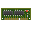
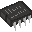
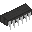
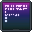

The machine has a number of devices attached to it. Each device can be accessed via _memory addresses,_ or _I/O ports._ These access methods are called Memory Mapped I/O (MMIO), and Port Mapped I/O (PMIO) The _memory address space_, and the _port address space_ are accessed via different instructions, as demonstrated below.

Example memory operations:
```
LOAD    R1, 420 ;   Read memory address 420 and load its value into R1.
STORE   R2, 52  ;   Write the value in R2 into memory address 52.
```
Example port operations:

```
IN      R3, =1  ;   Read from port 1 and load its value into R3.
OUT     R4, =0  ;   Write the value in R4 into port 4.
```

### Device list

| Image                                 | Category | Name                                   | Desc                                   |
| ------------------------------------- | -------- | -------------------------------------- | -------------------------------------- |
|              | System   | [RAM](dev_ram)                         | Volatile storage device.               |
|              | System   | [RTC](dev_rtc)                         | Real-Time Clock                        |
|              | System   | [CPU](dev_cpu)                         | CPU                                    |
|              | System   | [PIC](dev_pic)                         | (fix or remove) Interrupt controller   |
|       | HID      | [Legacy Terminal](dev_legacyterm)      | The dumbest, simplest human interface. |
|          | HID      | [PAD](dev_gamepad)                     | (TODO) Gamepad ports                   |
|              | Audio    | [PSG](dev_psg)                         | Simple audio chip.                     |
|             | Audio    | [MIDI](dev_midi)                       | (TODO) MIDI in / out                   |
|  | Video    | [display_classic](dev_display_classic) | Memory mapped framebuffer              |


Open the device page for a more detailed explanation on its behaviour.

### Memory Map
| Addr range (hex) | (decimal)     | Name                                                          | Description  |
| ---------------- | ------------- | ------------------------------------------------------------- | ------------ |
| 0x0000..=0x1FFF  | 0000..=8191   | RAM                                                           | 32 kB of ram |
| 0x2000..=0x6AFF  | 8192..=27391  | [Display](Display_Classic)                                    | Framebuffer  |
| 0x6B00..=0x6B0F  | 27392..=27407 | [[Interrupt Vector Table\|Exceptions#Interrupt-Vector-Table]] | (TODO)       |

### Ports
| Port | (dec) | Device                       | Symbol | Desc                                              |
| ---- | ----- | ---------------------------- | ------ | ------------------------------------------------- |
| 0x00 | 0     | [legacyterm](dev_legacyterm) | CRT    | Writing to this port shows the user a number.     |
| 0x01 | 1     | [legacyterm](dev_legacyterm) | KBD    | Read from here to request input from user.        |
| 0x02 | 2     | [rtc](dev_rtc)               | RTC    | Real-Time Clock. Returns local Unix time (32-bit) |
| ..   | ..    |                              |        |                                                   |
| 0x06 | 6     | STDIN                        | -      | Dummy device. Don't use.                          |
| 0x07 | 7     | STDOUT                       | -      | Dummy device. Don't use.                          |
| ..   | ..    |                              |        |                                                   |
| 0x20 | 32    | [pic](dev_pic)               | -      | PIC 0: Command port                               |
| 0x21 | 33    | [pic](dev_pic)               | -      | PIC 1: Mask port                                  |
| 0x22 | 34    | [pic](dev_pic)               | -      | PIC 2: Interrupt timer                            |
